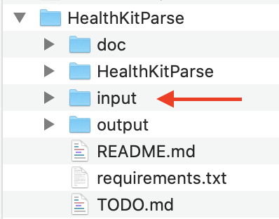
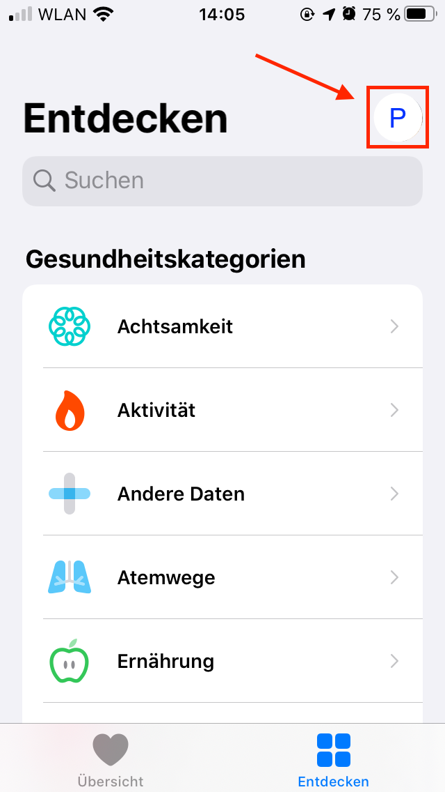
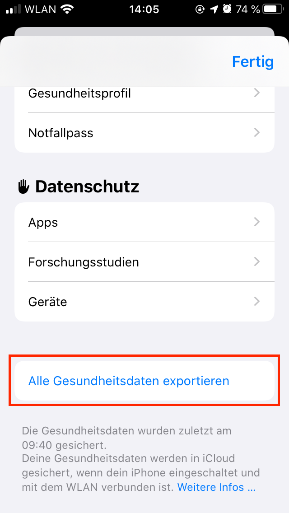
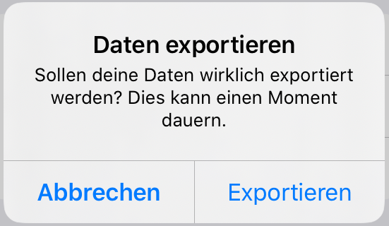
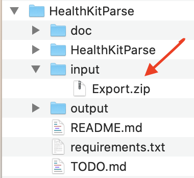

# HealthKitParse

 A simple Apple Health Kit export data parser

## How to export your Apple Health Kit data

1. Create an input folder inside the main folder ('/input')

    

2. Open Health App

    

3. Tap on your picture or icon (Top right)

    

4. Scroll down and tap on "Alle Gesundheitsdaten exportieren" (German)

    

5. Tap export and accept exporting

    

6. Wait till the export is finished and the form disapears

    

7. Store the export somewhere, where you can move it onto your computer
8. Shift the 'Export.zip' file in the folder created in step 1

    

9. Now [HealthkitParse.py](HealthkitParse/HealthkitParse.py) is able to work with the exported data
